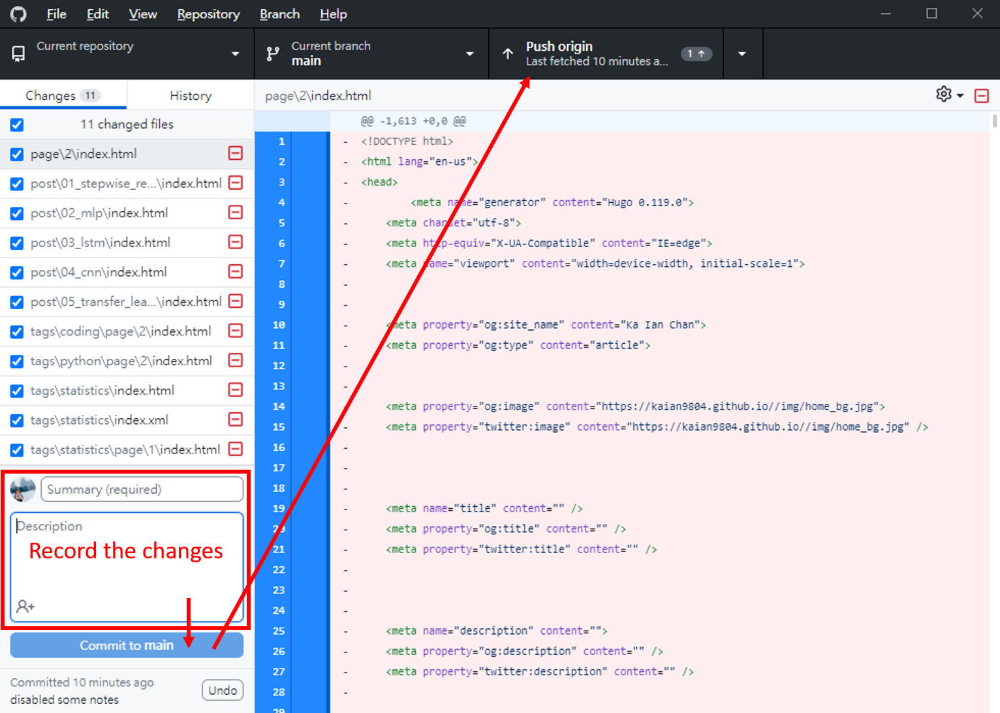

## Update this Website

After adding posts with Hugo, it is need to convert the files as HTML for displaying website.

1. Go to the GitHub and Hugo file

2. Start cmd

3. Enter "hugo" and press enter

4. The HTML codes will be generated in the "public" folder

5. Copy the codes to the GitHub folder where it can be uploaded via GitHub Desktop (C:\Users\user\Documents\GitHub\username.github.io)

6. The changes will be showed in GitHub Desktop

7. Write down summary and descriptions of changes, commit to main, and push the changes to GitHub

